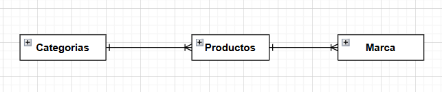
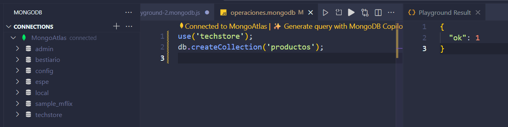

# 🐉 **LABORATORIO 1 MODELADO AVANZADO DE BASE DE DATOS**


---

## 🧩 **Autor**

**Nombre completo:** TNTE Pepinós Arboleda Brian  
**Asignatura:** Modelado avanzado de Base de Datos  
**Fecha:** 28 Octubre 2025  
**Repositorio de github:** 


https://github.com/BRIANPEPINOS/mision-mongodb-pepinos
---

# 🐉 **Análisis Comparativo (SQL vs NoSQL)**

| **Criterio** | **Solución Relacional (SQL)** | **Solución NoSQL (MongoDB)** | **Justificación para “TechStore”** |
|--------------|-------------------------------|-------------------------------|------------------------------------|
| **Flexibilidad de Esquema** | Rígido (requiere `ALTER TABLE` o el uso de tablas EAV). | Flexible (usa documentos JSON/BSON con estructura variable). | La tienda maneja productos con distintos atributos por ejemplo, laptops, smartphones y monitores, por lo que la flexibilidad de MongoDB permite añadir o eliminar campos sin alterar toda la base. |
| **Modelo de Datos** | Tablas normalizadas y relacionadas mediante claves foráneas (ej. `producto`, `detalle_laptop`). | Colección de documentos, cada documento representa un producto completo. | Un documento por producto simplifica la estructura y evita múltiples tablas para distintos tipos de artículos. |
| **Consulta de Datos** | Requiere consultas con `JOIN` para obtener información completa. | Las consultas se realizan sobre un único documento. | Se mejora el rendimiento y la velocidad al evitar combinaciones de tablas, ideal para catálogos en línea con muchas lecturas. |
---
# 🐉 **Diseño del Modelo Relacional (Conceptual)**

Cada producto pertenece obligatoriamente a una categoría y una marca,
y todas las categorías y marcas deben tener al menos un producto asociado

**Figura 1.** Diagrama Entidad–Relación (DER) del caso “TechStore”



---
# 🐉 **Diseño del Modelo NoSQL (MongoDB):**
### 🧩 Estructura general

```json
// Colección: productos
{
  "_id": "ObjectId(...)",
  "nombre": "String",
  "sku": "String (Indexado, Único)",
  "precio": "Number",
  "stock": "Number",
  "tipo_producto": "String (Enum: 'Laptop', 'Smartphone', 'Monitor')",
  "fecha_creacion": "Date",
  "especificaciones": {
    // Ejemplo Smartphone:
    // "pantalla": "6.1\"",
    // "ram_gb": 8,
    // Ejemplo Laptop:
    // "cpu": "Core i7",
    // "ram_gb": 16,
    // "dimensiones": { "alto_cm": 2.5, "ancho_cm": 35, "peso_kg": 1.8 }
  }
}
```
# 🐉 **Fase 2: Implementación y Manipulación**
Creacion de base datos


---
Insercion de datos
```json
// Colección: productos
db.productos.insertMany([
  {
    nombre: "SmartX Pro 6",
    sku: "SMX-P6-256BLK",
    precio: 799,
    stock: 25,
    tipo_producto: "Smartphone",
    fecha_creacion: new Date(),
    especificaciones: {
      pantalla: '6.1" OLED',
      ram_gb: 8,
      almacenamiento_gb: 256,
      so: "Android 14",
      camaras_mp: { principal: 50, ultra_wide: 12, selfie: 12 }
    }
  },
  {
    nombre: "NoteBook Z14",
    sku: "NBK-Z14-16-512",
    precio: 1199,
    stock: 8,
    tipo_producto: "Laptop",
    fecha_creacion: new Date(),
    especificaciones: {
      cpu: "Intel Core i7-12700H",
      ram_gb: 16,
      almacenamiento_gb: 512,
      gpu: "NVIDIA RTX 4050",
      dimensiones: { alto_cm: 2.0, ancho_cm: 35.0, peso_kg: 1.8 }
    }
  },
  {
    nombre: "VisionView Q27",
    sku: "MON-Q27-144",
    precio: 299,
    stock: 45,
    tipo_producto: "Monitor",
    fecha_creacion: new Date(),
    especificaciones: {
      tamanio_pulg: 27,
      resolucion: "2560x1440",
      panel: "IPS",
      frecuencia_hz: 144
    }
  }
]);
```
