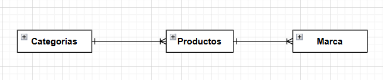
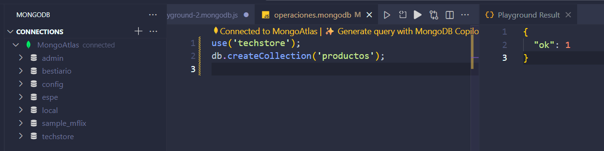
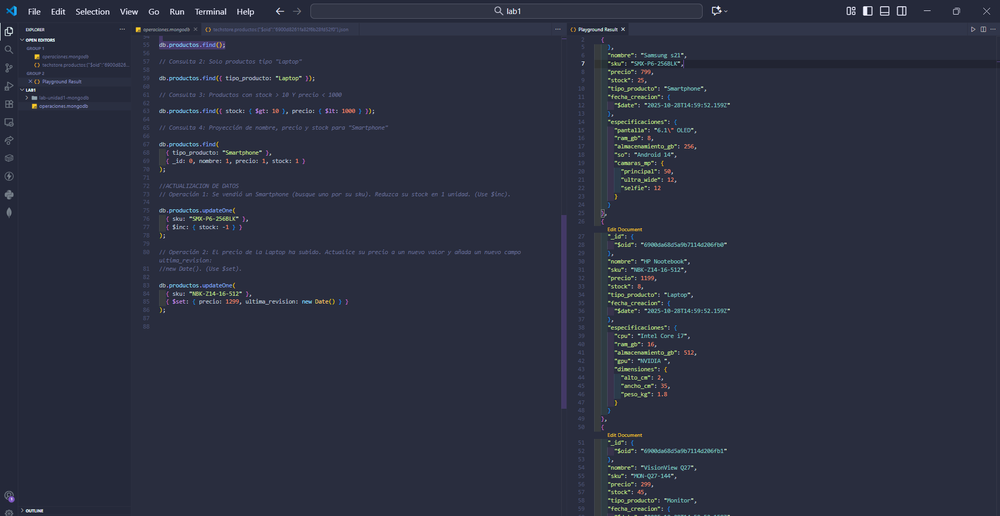
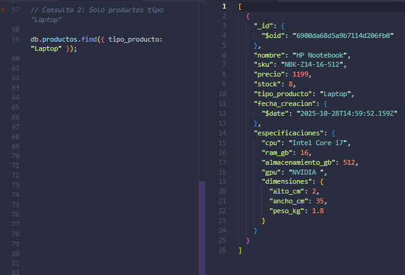
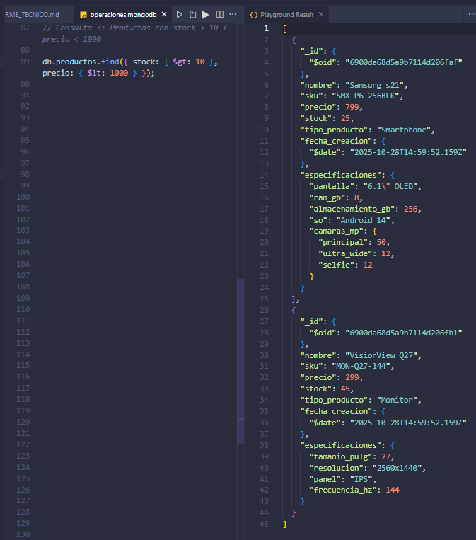
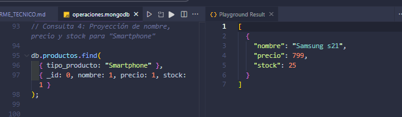
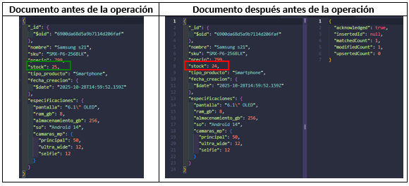
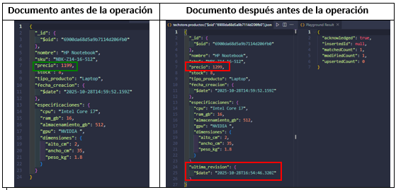

# **LABORATORIO 1 MODELADO AVANZADO DE BASE DE DATOS**


---

##  **Autor**

**Nombre completo:** TNTE Pepinós Arboleda Brian  
**Asignatura:** Modelado avanzado de Base de Datos  
**Fecha:** 28 Octubre 2025  
**Repositorio de github:** 

https://github.com/BRIANPEPINOS/Modelado-Avanzada-de-BDD/tree/f9d70cf26622c26488bdeeeee3c8784403a0db9f/lab-unidad1-mongodb

---

#  **Análisis Comparativo (SQL vs NoSQL)**

| **Criterio** | **Solución Relacional (SQL)** | **Solución NoSQL (MongoDB)** | **Justificación para “TechStore”** |
|--------------|-------------------------------|-------------------------------|------------------------------------|
| **Flexibilidad de Esquema** | Rígido (requiere `ALTER TABLE` o el uso de tablas EAV). | Flexible (usa documentos JSON/BSON con estructura variable). | La tienda maneja productos con distintos atributos por ejemplo, laptops, smartphones y monitores, por lo que la flexibilidad de MongoDB permite añadir o eliminar campos sin alterar toda la base. |
| **Modelo de Datos** | Tablas normalizadas y relacionadas mediante claves foráneas (ej. `producto`, `detalle_laptop`). | Colección de documentos, cada documento representa un producto completo. | Un documento por producto simplifica la estructura y evita múltiples tablas para distintos tipos de artículos. |
| **Consulta de Datos** | Requiere consultas con `JOIN` para obtener información completa. | Las consultas se realizan sobre un único documento. | Se mejora el rendimiento y la velocidad al evitar combinaciones de tablas, ideal para catálogos en línea con muchas lecturas. |
---
#  **Diseño del Modelo Relacional (Conceptual)**

Cada producto pertenece obligatoriamente a una categoría y una marca,
y todas las categorías y marcas deben tener al menos un producto asociado

**Figura 1.** Diagrama Entidad–Relación (DER) del caso “TechStore”



---
#  **Diseño del Modelo NoSQL (MongoDB):**
###  Estructura general

```json
// Colección: productos
{
  "_id": "ObjectId(...)",
  "nombre": "String",
  "sku": "String (Indexado, Único)",
  "precio": "Number",
  "stock": "Number",
  "tipo_producto": "String (Enum: 'Laptop', 'Smartphone', 'Monitor')",
  "fecha_creacion": "Date",
  "especificaciones": {
    // Ejemplo Smartphone:
    // "pantalla": "6.1\"",
    // "ram_gb": 8,
    // Ejemplo Laptop:
    // "cpu": "Core i7",
    // "ram_gb": 16,
    // "dimensiones": { "alto_cm": 2.5, "ancho_cm": 35, "peso_kg": 1.8 }
  }
}
```
#  **Fase 2: Implementación y Manipulación**
## Preparación del Entorno
Se añade los comandos para conectarse a la base de datos  y seleccionar la base de datos techstore,  
ademas de un comando para borrar la colección productos al inicio, para asegurar que el script sea re-ejecutable.
```json
use('techstore');
db.productos.drop();
```


---
## Inserción de datos

```json
// Colección: productos
db.productos.insertMany([
  {
    nombre: "SmartX Pro 6",
    sku: "SMX-P6-256BLK",
    precio: 799,
    stock: 25,
    tipo_producto: "Smartphone",
    fecha_creacion: new Date(),
    especificaciones: {
      pantalla: '6.1" OLED',
      ram_gb: 8,
      almacenamiento_gb: 256,
      so: "Android 14",
      camaras_mp: { principal: 50, ultra_wide: 12, selfie: 12 }
    }
  },
  {
    nombre: "NoteBook Z14",
    sku: "NBK-Z14-16-512",
    precio: 1199,
    stock: 8,
    tipo_producto: "Laptop",
    fecha_creacion: new Date(),
    especificaciones: {
      cpu: "Intel Core i7-12700H",
      ram_gb: 16,
      almacenamiento_gb: 512,
      gpu: "NVIDIA RTX 4050",
      dimensiones: { alto_cm: 2.0, ancho_cm: 35.0, peso_kg: 1.8 }
    }
  },
  {
    nombre: "VisionView Q27",
    sku: "MON-Q27-144",
    precio: 299,
    stock: 45,
    tipo_producto: "Monitor",
    fecha_creacion: new Date(),
    especificaciones: {
      tamanio_pulg: 27,
      resolucion: "2560x1440",
      panel: "IPS",
      frecuencia_hz: 144
    }
  }
]);
```
---
## Lectura de datos

Para realizar las diferentes consultas en base a los productos agregados recientemente se realizan los siguientes comandos.

---
### Consulta 1:  Mostrar todos los productos en la colección
```json
// Consulta 1: Mostrar todos los productos

db.productos.find();
```
###  Consulta 2: Mostrar solo los productos que sean de tipo "Laptop". 
```json
// Consulta 2: Solo productos tipo "Laptop"

db.productos.find({ tipo_producto: "Laptop" });
```
###  Consulta 3: Mostrar los productos que tengan más de 10 unidades en stock Y un precio menor a 1000.
```json
// Consulta 3: Productos con stock > 10 Y precio < 1000

db.productos.find({ stock: { $gt: 10 }, precio: { $lt: 1000 } });
```
###  Consulta 4: Mostrar solo el nombre, precio y stock de los "Smartphone" (Proyección)
```json
// Consulta 4: Proyección de nombre, precio y stock para "Smartphone"

db.productos.find(
  { tipo_producto: "Smartphone" },
  { _id: 0, nombre: 1, precio: 1, stock: 1 }
);
```
---
## Actualización de Datos (Update)
En esta seccion se actualizan ciertos datos de diferentes productos, para ello se realizaron dos operaciones.

---
### Operación 1: Se vendió un Smartphone (busque uno por su sku). Reduzca su stock en 1 unidad. (Use $inc). 
```json

db.productos.updateOne(
  { sku: "SMX-P6-256BLK" },
  { $inc: { stock: -1 } }
);
```
### Operación 2: El precio de la Laptop ha subido. Actualice su precio a un nuevo valor y añada un nuevo campo ultima_revision: new Date(). (Use $set).
```json

db.productos.updateOne(
  { sku: "NBK-Z14-16-512" },
  { $set: { precio: 1299, ultima_revision: new Date() } }
);
```
#  **Fase 3: Resultados de la ejecución**

**Figura 2.** Comandos para crear la base de datos”



**Figura 3.** Resultado y ejecución consulta 1:  Mostrar todos los productos en la colección.”



**Figura 4.** Resultado y ejecución consulta 2:   Mostrar solo los productos que sean de tipo "Laptop".”



**Figura 5.** Resultado y ejecución consulta 3: Mostrar los productos que tengan más de 10 unidades en stock Y un precio menor a 1000.”



**Figura 6.** Resultado y ejecución consulta 4: Mostrar solo el nombre, precio y stock de los "Smartphone" (Proyección).”



**Figura 7.** Resultado y ejecución operación 1: Se vendió un Smartphone (busque uno por su sku). Reduzca su stock en 1 unidad. (Use $inc). ”



**Figura 8.** Resultado y ejecución operación 2 : El precio de la Laptop ha subido. Actualice su precio a un nuevo valor y añada un nuevo campo ultima_revision: 
new Date(). (Use $set).”




#  **Fase 4: Análisis reflexivo**

### Pregunta 1: ¿Cuál fue la ventaja más significativa de usar un modelo de documento (MongoDB) para el caso "TechStore" en comparación con el modelo relacional que diseñó?

En mi caso, la ventaja más importante fue la flexibilidad del modelo de documento. En lugar de tener que crear varias tablas relacionadas y usar consultas con JOIN, en MongoDB pude guardar toda la información de un producto en un solo documento, permitiendo representar fácilmente productos con diferentes tipos de especificaciones sin tener que modificar la estructura general de la base de datos


### Pregunta 2: ¿Cómo facilita el anidamiento de documentos (el campo especificaciones) la gestión de datos heterogéneos (diferentes atributos por producto)? 

El anidamiento de documentos me permitió agrupar dentro del mismo registro los detalles específicos de cada tipo de producto. Por ejemplo, un smartphone tiene cámara y sistema operativo, mientras que una laptop tiene procesador y tarjeta gráfica. Gracias a ese campo anidado especificaciones, pude mantener todos esos datos juntos, evitando crear muchas tablas adicionales.

### Pregunta 3: ¿Qué problemas potenciales podría enfrentar esta base de datos a futuro si no se controla la flexibilidad del esquema (es decir, si se permite insertar cualquier dato)

Si no se controla la estructura, la base podría llenarse de documentos inconsistentes.Algunos productos podrían no tener campos importantes como precio o stock, o podrían tener nombres de atributos mal escritos.

### Pregunta 4: ¿Qué paso técnico recomendaría a continuación para "profesionalizar" esta base de datos? (Piense en rendimiento e integridad de datos que no cubrimos en este laboratorio). 

Lo primero que haría sería implementar un validador JSON Schema para asegurar que todos los documentos cumplan con una estructura mínima. Por ejemplo, que nombre, precio y tipo_producto sean obligatorios y del tipo correcto.